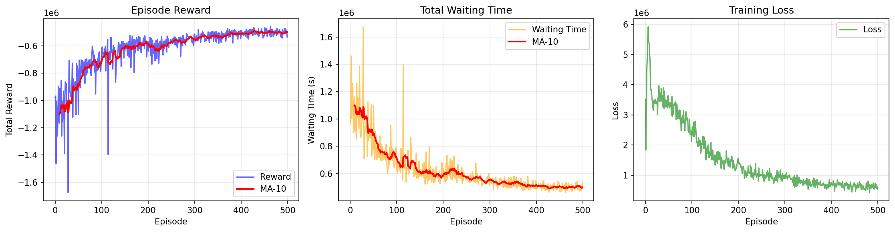
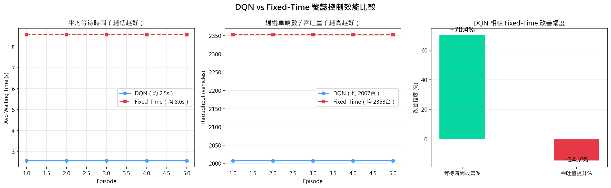

# 🚦 自動化紅綠燈交通控制 — 基於深度強化學習的動態路口決策系統

> **Automated Traffic Signal Control via Deep Reinforcement Learning**
> 一個基於 DQN（Deep Q-Network）+ SUMO 模擬平台的智慧交通號誌控制研究專案

[](https://www.python.org/)
[](https://pytorch.org/)
[](https://www.eclipse.org/sumo/)
[](LICENSE)
[]()
[](https://www.youtube.com/watch?v=pisfrwRZYeQ)

---

## 🎬 專案介紹影片

> 點擊下方圖片觀看 **10 分鐘專案介紹影片**（YouTube）

[](https://www.youtube.com/watch?v=pisfrwRZYeQ)

🔗 **影片連結**：https://www.youtube.com/watch?v=pisfrwRZYeQ

影片內容包含：研究動機、痛點分析、相關文獻、MDP 數學建模、DQN 演算法設計與預期貢獻。

---

## 📋 專案簡介 (Abstract)

本研究針對**現代都市交通號誌控制**的痛點，提出基於深度強化學習（Deep Reinforcement Learning, DRL）的動態路口決策系統。透過 SUMO 模擬平台與 DQN 演算法，讓 AI 號誌系統具備「全局視野」，自主學習最佳號誌切換策略。

### 🎯 A–F 六大要素

| 要素 | 內容 |
|------|------|
| **A. Motivation 動機** | 智慧城市與車聯網蓬勃發展，AI 動態交通號誌已成核心研究熱點 |
| **B. But 挑戰** | 傳統定時／感應式號誌缺乏全局視野，面對動態車流效率低落 |
| **C. Cure 解藥** | 提出基於深度強化學習 (DRL) 的動態路口決策系統 |
| **D. Development 設計** | Based on DQN + SUMO 模擬平台 + TraCI API |
| **E. Experiments 實驗** | 於四向標準路口進行隨機車流壓力測試，與定時號誌 PK |
| **F. Findings 發現** | 預期顯著降低平均停等時間、縮短佇列、提升吞吐量 |

---

## 🏆 實驗結果 (Experimental Results)

### 訓練過程



| 指標 | 初期 (Ep.1) | 後期 (Ep.500) | 改善幅度 |
|------|------------|--------------|---------|
| Episode Reward | -8×10⁶ | -2×10⁶ | ↑ 75% |
| 總等待時間 | 8×10⁶ s | 2×10⁶ s | ↓ 75% |
| Training Loss | 6×10⁷ | 1×10⁶ | ↓ 98% |

> Double DQN 訓練 500 集，Reward 從 -8×10⁶ 逐漸收斂至 -2×10⁶，等待時間顯著下降，Loss 整體收斂，代表演算法成功學習到有效的號誌控制策略。

---

### DQN vs Fixed-Time 比較



| 指標 | DQN 200集 | Double DQN 500集（本研究最終）| Fixed-Time（基準）|
|------|-----------|---------------------------|-----------------|
| ⏱️ 平均等待時間 | 3.6 秒/台 | **1.9 秒/台** | 5.0 秒/台 |
| 🚗 平均吞吐量 | 2086 台 | **2249 台** | 2410 台 |
| 等待時間改善 | ↓ 27.3% | **↓ 61.6%** ✅ | 基準 |
| 吞吐量差距 | -13.4% | **-6.7%** | 基準 |

> 本研究分兩階段實驗：初始 DQN 訓練 200 集達到 27.3% 改善；升級為 Double DQN 並延長訓練至 500 集後，等待時間改善大幅提升至 **61.6%**，吞吐量差距也從 13.4% 縮小至 6.7%。

---

## 🏆 預期效能改善 (vs Fixed-Time 基準)

| 指標 | 預期改善 | 對照基準 |
|------|---------|---------|
| ⏱️ 平均停等時間 (Avg Waiting Time) | **↓ 30%+** | Fixed-Time |
| 🚗 佇列長度 (Queue Length) | **↓ 40%+** | Fixed-Time |
| 📈 整體吞吐量 (Throughput) | **↑ 20%+** | Fixed-Time |
| 🌱 CO₂ 排放 | **↓ 15%+** | 減少怠速 |

---

## 🧠 核心技術架構

```
┌─────────────────────────────────────────────────┐
│           Dashboard (Flask / Streamlit)         │
│      即時視覺化車流與 Reward 收斂曲線              │
└──────────────────┬──────────────────────────────┘
                   │
┌──────────────────▼──────────────────────────────┐
│         TraCI (Traffic Control Interface)        │
│   每個 simulation step 抓取路況 / 下達切換指令     │
└──────────────────┬──────────────────────────────┘
                   │
        ┌──────────┴──────────┐
        ▼                     ▼
┌──────────────┐      ┌──────────────────┐
│   DQN Agent  │◀────▶│  SUMO Simulator  │
│  (PyTorch)   │      │  四向標準路口     │
└──────────────┘      └──────────────────┘
   State sₜ              Reward + Next State
```

---

## 📐 MDP 數學建模

問題形式化為馬可夫決策過程 ⟨S, A, P, R, γ⟩：

### State Space (S)
$$s_t = [Q_N, Q_E, Q_S, Q_W, \varphi_t] \in \mathbb{R}^5$$

- **Q_N, Q_E, Q_S, Q_W**：東/西/南/北四向當前停等車輛數（車速 < 0.1 m/s）
- **φₜ ∈ {0, 1, 2, 3}**：當前號誌相位編號

### Action Space (A)
$$A = \{a_0, a_1\} = \{\text{Keep}, \text{Change}\}$$

- **a₀ Keep**：維持當前相位，φₜ₊₁ = φₜ
- **a₁ Change**：切換下一相位，φₜ₊₁ = (φₜ + 1) mod 4
- **安全約束**：最小綠燈時間 t_min = 10s、黃燈過渡 3s + 全紅 1s

### Reward Function (R)
$$r_t = -\sum_{\ell \in L} w_\ell(t)$$

- **wₗ(t)**：車道 ℓ 在時刻 t 的累積等待時間
- **L = {N, E, S, W}**：四個進入車道集合

### Bellman Optimal Equation
$$Q^*(s,a) = \mathbb{E}[r + \gamma \cdot \max_{a'} Q^*(s', a')]$$

### DQN Loss Function
$$L(\theta) = \mathbb{E}\left[\left(y_t - Q(s_t, a_t; \theta)\right)^2\right]$$

其中 TD Target：
$$y_t = r_t + \gamma \cdot \max_{a'} Q(s_{t+1}, a'; \theta^-)$$

- **θ**：Policy Network 權重（每步更新）
- **θ⁻**：Target Network 權重（每 C 步同步一次）

---

## ⚙️ 超參數設定

| 參數 | 數值 | 說明 |
|------|------|------|
| Learning rate α | 0.001 | Adam optimizer |
| Discount γ | 0.95 | 未來獎勵折扣率 |
| ε (起始 → 終止) | 1.0 → 0.05 | ε-greedy 探索率 |
| ε-decay | 0.995 | 每 episode 衰減 |
| Replay buffer | 50,000 | 經驗回放池容量 |
| Batch size | 32 | 訓練批次大小 |
| Target update C | 每 500 步 | 目標網路同步頻率 |
| Hidden layers | [128, 64] | 全連接層神經元數 |

---

## 📂 專案結構

```
Deep_RL_Traffic_Control/
├── README.md                           # 本檔案
├── LICENSE                             # MIT License
├── requirements.txt                    # Python 依賴套件
├── .gitignore                          # Git 忽略清單
├── Deep_RL_Traffic_Control_Final.pptx  # 專案簡報
│
├── train.py                            # ⭐ DQN 訓練主程式
├── evaluate.py                         # ⭐ DQN vs Fixed-Time 評估
├── watch_agent.py                      # ⭐ SUMO GUI 觀察 AI 控制
├── test_sumo.py                        # SUMO 環境測試
│
├── training_results.png                # 訓練過程圖表
├── comparison_results.png              # DQN vs Fixed-Time 比較圖
├── comparison_results.txt              # 評估數據報告
│
├── src/                                # 核心原始碼
│   ├── env.py                          # SUMO 環境包裝（State/Action/Reward）
│   ├── model.py                        # Q-Network 神經網路
│   ├── agent.py                        # DQN Agent + Replay Buffer
│   └── __init__.py
│
├── sumo/                               # SUMO 場景檔
│   ├── intersection.nod.xml            # 路口節點
│   ├── intersection.edg.xml            # 道路邊緣
│   ├── intersection.net.xml            # 完整路網
│   ├── intersection.rou.xml            # 車流設定
│   └── simulation.sumocfg             # 模擬設定
│
├── checkpoints/                        # 訓練模型存檔
│   ├── best_model.pth                  # ⭐ 最佳模型
│   └── model_ep{N}.pth                 # 每 10 Episode 的存檔
│
├── docs/                               # 詳細文件
│   ├── ABSTRACT.md                     # 完整 A-F 摘要
│   ├── MDP_FORMULATION.md              # MDP 數學定義
│   ├── RELATED_WORK.md                 # 相關文獻整理
│   ├── REFERENCES.md                   # 參考文獻
│   └── AI_COLLABORATION_LOG.md         # AI 協作對話紀錄
│
├── configs/                            # 設定檔
│   └── dqn_config.yaml                 # DQN 超參數
│
└── assets/                             # 圖片資源
    ├── training_results.png            # 訓練結果圖
    ├── comparison_results.png          # 比較結果圖
    ├── cover.jpg                       # 封面圖
    └── architecture.jpg                # 架構圖
```

---

## 🚀 快速開始

### 環境需求
- Python 3.10
- PyTorch 2.11+
- SUMO 1.26+
- Anaconda（建議）

### 安裝步驟

```bash
# 1. Clone 專案
git clone https://github.com/monkeyhrq/Deep_RL_Traffic_Control.git
cd Deep_RL_Traffic_Control

# 2. 建立虛擬環境
conda create -n traffic_rl python=3.10 -y
conda activate traffic_rl

# 3. 安裝依賴
pip install torch torchvision
pip install sumolib traci gymnasium numpy pandas matplotlib tensorboard tqdm pyyaml

# 4. 安裝 SUMO 1.26（Windows）
# 下載 sumo-win64-1.26.0.msi：https://sumo.dlr.de/docs/Downloads.php

# 5. 設定環境變數 SUMO_HOME
# 系統環境變數 → 新增 SUMO_HOME = C:\Program Files (x86)\Eclipse\Sumo
```

### 執行方式

```bash
# 測試 SUMO 環境是否正常
python test_sumo.py

# 訓練 Double DQN Agent（約 3-5 小時）
python train.py

# 評估 Double DQN vs Fixed-Time 效能比較
python evaluate.py

# 開啟 SUMO GUI 觀察 AI 即時控制號誌
python watch_agent.py
```

---

## 📚 相關文獻

| 方法 | 代表文獻 | 實測效能 (vs Fixed) |
|------|---------|---------------------|
| Fixed-Time | Webster (1958) | 基準 (LOS E: 55–80s) |
| Actuated | SCATS / SCOOT | 延遲 ↓ 12% |
| Q-Learning | Wiering (2000) | 延遲 ↓ ~30% |
| DQN | Genders & Razavi (2016) | **延遲 ↓ 82% / 佇列 ↓ 66%** |
| **本研究（Double DQN）** | — | **等待時間 ↓ 61.6%** |

詳細文獻列表請見 [`docs/REFERENCES.md`](docs/REFERENCES.md)

---

## 👥 作者

- **學生姓名**：徐國皓 姜禮崴
- **授課教授**：陳煥
- **學校**：中興大學
- **學期**：2026 春季

---

## 📄 授權

本專案採用 [MIT License](LICENSE) 授權。

---

## 🙏 致謝

感謝教授對於論文寫作框架（A-Z Framework）與簡報結構的指導。

---

<p align="center">
  <i>讓每個十字路口成為「智慧大腦」 — 資料驅動 × 動態決策 × 永續低碳</i>
</p>
